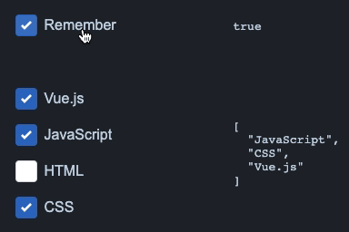

# vue-mzc-checkbox
Simple Vue2 checkbox component



[Online demo](https://codesandbox.io/s/cocky-rgb-9cm1k?file=/src/App.vue)

## Installation
```sh
npm install vue-mzc-checkbox --save
```

## Usage
```js
import VueMzcCheckbox from "vue-mzc-checkbox";
import "vue-mzc-checkbox/src/vue-mzc-checkbox.css";

export default {
  components: {
    VueMzcCheckbox,
  },
  data() {
    return {
      remember: true,
      selected: [
        "Vue.js",
        "JavaScript",
        "CSS",
      ],
    };
  },
};
```
```html
<vue-mzc-checkbox v-model="remember" value="remember">Remember</vue-mzc-checkbox>
<vue-mzc-checkbox v-model="selected" value="Vue.js">Vue.js</vue-mzc-checkbox>
<vue-mzc-checkbox v-model="selected" value="JavaScript">JavaScript</vue-mzc-checkbox>
<vue-mzc-checkbox v-model="selected" value="HTML">HTML</vue-mzc-checkbox>
<vue-mzc-checkbox v-model="selected" value="CSS">CSS</vue-mzc-checkbox>
```
## Customize
```css
.vue-mzc-checkbox {
  --vue-mzc-checkbox-size: 24px;
  --vue-mzc-checkbox-gap: 8px;
  --vue-mzc-checkbox-border-radius: 4px;
  --vue-mzc-checkbox-border-color: #dddddd;
  --vue-mzc-checkbox-border-hover-color: #cccccc;
  --vue-mzc-checkbox-background-color: #ffffff;
  --vue-mzc-checkbox-icon-color: #ffffff;
  --vue-mzc-checkbox-primary-color: #306EC4;
  --vue-mzc-checkbox-primary-hover-color: #3F78C7;
}
```
